# Hamim Saad Al Raji

**AI / GenAI Engineer** &nbsp;·&nbsp; Full-stack Developer &nbsp;·&nbsp; Dhaka, Bangladesh

*Turning language models into products people actually use.*

[Portfolio](https://hamimsaadalraji.vercel.app/) &nbsp;/&nbsp;
[LinkedIn](https://linkedin.com/in/hamim-saad-al-raji/) &nbsp;/&nbsp;
[Email](mailto:hamimsaad.raji@gmail.com) &nbsp;/&nbsp;
[YouTube](https://www.youtube.com/@HowICompletedEngineering)

 

I'm a Software Engineering graduate from **IUT** working where AI meets real product engineering: RAG pipelines, multimodal apps, and voice agents. I care just as much about the part nobody demos, the typed, tested backend that keeps those models fast and reliable.

I'm currently open to **AI/GenAI Engineer** and **ML Engineer** roles.

 

### ◇ &nbsp;Research

<picture>
  <source media="(prefers-color-scheme: dark)" srcset="assets/paper-dark.svg">
  
</picture>

  

### ◇ &nbsp;Recognition

<picture>
  <source media="(prefers-color-scheme: dark)" srcset="assets/recognition-dark.svg">
  
</picture>

  

### ◇ &nbsp;Selected work

| Project | What it does | Built with |
|:--|:--|:--|
| **[AI Interviewer](https://ai-interviewer-eight-wheat.vercel.app/)**  [demo](https://youtu.be/NPTAzTttpvM) | Voice mock-interviews with adaptive, LLM-generated questions, scored by an LLM-as-a-Judge | Next.js · VAPI · Gemini · Firebase |
| **[Campus Haat](https://campus-haat.vercel.app/)**  [code](https://github.com/HamimSaadAlRaji/Coderush-Hackathon) | University marketplace where Gemini Vision writes listings from photos, with English & Bangla voice input and geofenced meetup maps | Next.js · MongoDB · Groq · Docker |
| **YouTube-Buddy**  [demo](https://www.youtube.com/watch?v=v7lxI67N0-w) | Chrome extension that lets you ask questions about any YouTube video, using RAG over its transcript | LangChain · Gemini · Python · Azure |
| **[MarketPulse](https://huggingface.co/HamimSaad/distilbert-fin-sentiment)** | Fine-tuned DistilBERT for financial sentiment (0.85 weighted F1 vs 0.76 baseline), served as a tested API | PyTorch · Transformers · FastAPI · Docker |
| **[Robotic Arm Sim](https://techa-thon-final.vercel.app/)** | 6-DOF industrial arm in the browser with inverse kinematics and keyboard, joystick, voice & natural-language control | JavaScript · Gemini |
| **[NijerJomi](https://github.com/HamimSaadAlRaji/NijerJomi)** | Tamper-proof, blockchain-based land registry designed for Bangladesh | React · TypeScript · Tailwind |

 

### ◇ &nbsp;Experience

**Full Stack Developer Intern** · Trust Innovation Limited (ICT company of the Bangladesh Army) · *Oct 2025 – Feb 2026*
Led development of TIL-EMS, an education management system handling 10,000+ student records. Built a double-entry accounting system with a cron-driven monthly fee engine, and broke a 2,300-line monolith into clean modules.

 

### ◇ &nbsp;Toolbox

  

**AI layer:** LangChain · RAG · Embeddings & Vector Search · Gemini / Groq · VAPI · MCP · LLM-as-a-Judge

 

Build it. Measure it honestly. Ship it.

